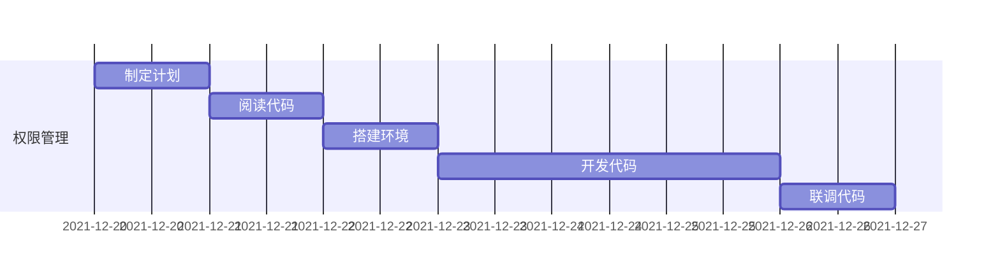

## 计划

```mermaid
gantt
    dateFormat YYYY-MM-DD
	
    section 权限管理
	制定计划               :         des1, 2021-12-20,2021-12-21
	阅读代码               :         des2, after des1, 1d
	搭建环境               :         des3, after des2, 1d
	开发代码               :         des4, after des3, 3d
	联调代码               :         des5, after des4, 1d
	
```

## 开发代码
- 增加操作日志
- 授权记录根据权限进行显示
- 重构获取租户的服务和功能接口, 构建租户的权限列表
- 增加运维,运营的权限, 构造初始化脚本
- 构建权限列表数据

## 资料-Output
## 资料-Input
![[1权限管理输入#代码管理]]
![[1权限管理输入#原型]]

## 资料-Context