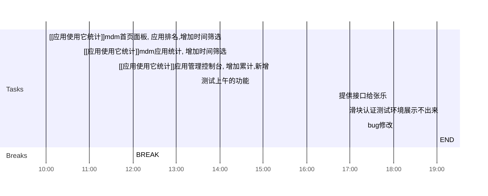

## Day Planner

### 上午安排
- [x] 10:00 [[应用使用它统计]]mdm首页面板, 应用排名,增加时间筛选
	- 通知张乐,修改对应的web, 接口增加了startTime,endTime(时间毫秒数)
- [x] 10:48 [[应用使用它统计]]mdm应用统计, 增加时间筛选
	- 通知张乐,修改对应的web, 接口增加了startTime,endTime(时间毫秒数)
- [x] 11:36 [[应用使用它统计]]应用管理控制台, 增加累计,新增
	- 通知张乐,修改对应的web, 接口增加了statType, sum:累计, new:新增
- [x] 12:00 BREAK

### 下午安排
- [x] 13:30 测试上午的功能
- [x] 16:40 提供接口给张乐
- [x] 16:55 滑块认证测试环境展示不出来
- [x] 19:00 END