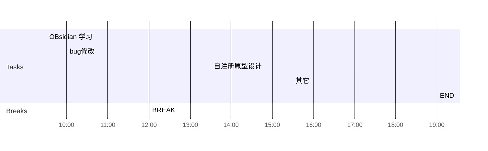

## Day Planner

## 上午安排
- [x] 09:30 OBsidian 学习
- [x] 10:00 bug修改
	- 23941 --------------------------------
	- 23900 国际化, 暂不修改-----------------------------
	- 23899 国际化, 暂不修改----------------------
	- 23839 国际化, 暂不修改--------------
	- 23853 暂未实现, 审核提醒,发送短信, 暂不修改-----------
	- 23856 最后修改,预览效果, 暂不修改------------
	- 23886 暂不增加, 审核日志--------------------
	- 23850 需要验证????-------------------------------------------
	- 23835 需要姜睿确定一下如何修改------------------------------
	- 23797 修改原型, 导出的模板-------------
	- 23847 运维, 编辑服务--------------
	- 23962, 23961,----------------------
- [x] 12:00 BREAK
- [x] 19:00 END
