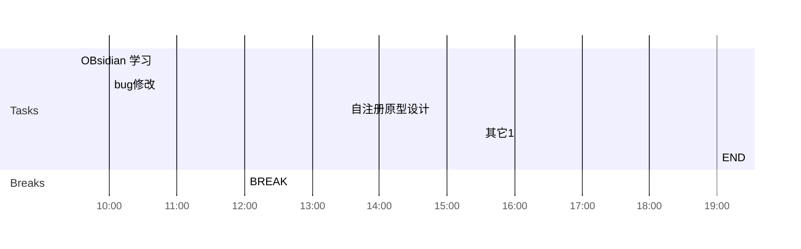

## Day Planner

## 上午安排
- [x] 09:30 OBsidian 学习
- [x] 10:00 bug修改
- [ ] 12:00 BREAK

## 下午安排
- [ ] 13:30 自注册原型设计
- [ ] 15:30 其它1
- [ ] 19:00 END

权限管理(name)

权限管理资料(output)

时间轴(method, line)

权限管理资料(input)

资料 context