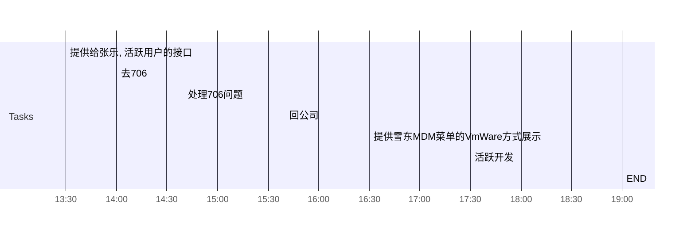

- 授权记录, 展示原则
	- 
- 操作日志, 还未展示
	- 
- 新加服务, 登录功能是否给所有管理员
	- 手动添加权限脚本, 运营授权, 才可以看到
	- 没有勾选, 则认为无法登录
- MDM菜单, 按vmware整理
	- 

## Day Planner

## 下午安排
- [x] 13:30 提供给张乐, 活跃用户的接口
- [x] 14:00 去706
- [ ] 14:40 处理706问题
- [ ] 15:40 回公司
- [ ] 16:30 提供雪东MDM菜单的VmWare方式展示
- [ ] 17:30 活跃开发
- [ ] 19:00 END