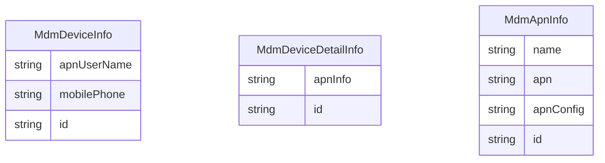

## 序列图
![[Sequence Diagram1 4.jpg]]

## ER图

## 测试
1. apn信息的增删改查
2. apn信息的推送
3. 设备的APN信息的上报
4. 设备APN信息的展示

## 分支信息
1. 内蒙古mdm的分支 mdm3.3-newpolicy-release-1.6.0.beta
2. 公安部分支 mdm3.3-standard-release-1.1.0.beta
3. 开发分支从公安部分支切出， mdm3.3-gonganbu-apn
	1. 开发完成后，合并到公安部分支

## 类图
1. 涉及到的类
	1. controller
		1. MdmApnController 增删改查APN
		2. TransController  批量发送命令
		3. DeviceClientController    获取设备的ApnInfo信息
			1. full_update_device_info
			2. inc_update_device_info
		4. NewDeviceInfoCommand  获取设备的ApnInfo信息
	2. model
		1. MdmDeviceDetaiInfo  增加apn_info
		2. MdmApnInfo
		3. MdmDeviceInfo 增加mobilePhone和apnUserName
	3. log
		1. ApnLogger
		2. ActionHistoryAop
	4. swagger
		1. SwaggerConfig
	5. i18n
		1. 冲突, 不需要增加国际化信息
		2. 300078 ，910014， 910011， 910001， 910002
	6. cmd   下发apn信息命令
		1. NewConfigApnCommand
	7. db
		1. apnInfo
		2. deviceInfo
		3. deviceDetailInfo
	8. other
		1. hibernate.cfg.xml
		2. applicationContext.xml
		3. pom.xml

1. 153环境
	1. 重启uas，mdm服务
	2. 修改/apps/pekall/config/目录下的audit.properties.example为audit.properties
	3. 修改字段mdm_application_info中的id，mdm_application_relation中的app_id, mdm_application_staus中的app_id, 函数remove_application中的_app_id 为200
	4. https://192.168.11.153:4432  pekall/pekall1234