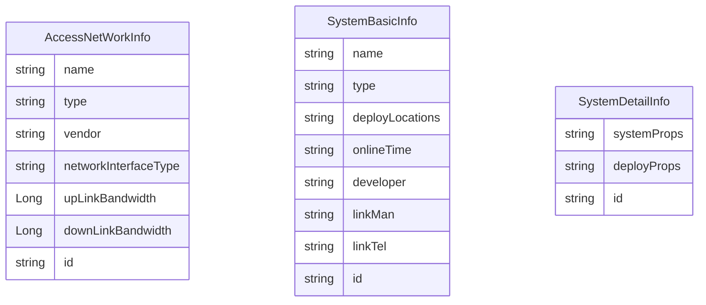

## 改动内容
1. 针对湖南的项目，重点关注
	1. 资产管理
	2. 日志审计
	3. 系统设置
	4. 分级分权，使用标准版的uas，定义菜单
	5. 数据搜集，使用flink
	6. 后续工作
		1. 熟悉需求，确定实体
2. 全国集中管控， 升级现有的全国集中管控
	1. 修改点
	2. web端数据查询优化
	3. ES有查询窗口，暂不需要
	4. 报表功能
	5. 报表导出，有哪些，包含mdm，app等
		1. 最终统一成一个系统，进行报表导出]
3. 原型
	1. 基础设置中的接入网络和网络设备的差别
		1. 接入网络，是电信等
		2. 需要增加对应的model
		3. 链路名称，链路类型（互联网接入，专网接入），运营商（移动，联通，电信）， 接口类型（光纤，以太网，其它）， 上行带宽，下行带宽，更新时间，更新管理员
		4. 增删改查
	2. 应用支撑
		1. 系统名称，系统类型（应用市场，服务总线，统一认证，统一授权，目录服务，其它），部署位置（一区，二区，三区），上线时间，开发单位，联系人，联系电话，更新时间，更新管理员
		2. 系统属性，增加，修改，删除
		3. 部署信息，增加，修改，删除
			1. 部署位置，服务器名称，服务器IP
		4. 增删改查
	3. 管控系统
		1. 系统名称，系统类型（PKI系统，终端管控系统，集中管控系统， 其它），部署位置（一区，二区，三区），上线时间，开发单位，联系人，联系电话，更新时间，更新管理员
		2. 系统属性，增加，修改，删除
		3. 部署信息，增加，修改，删除
			1. 部署位置，服务器名称，服务器IP
		4. 增删改查
	4. 应用服务--待完成
	5. 建设状态，增加了一个图--------web端实现
	6. 权限管理

## ER图

## 测试内容
1. 接入网络信息的增删改查
2. 应用支撑基础信息的增删改查
3. 应用支撑详情信息的增删改查
4. 管控系统基础信息的增删改查
5. 管控系统详情信息的增删改查
6. 统一认证中的权限菜单内容
7. 集中管控，支持菜单权限，不支持数据权限

## 分支信息
1. 服务端基础分值dev3.0
2. 服务端开发分支 cmc_dev_5.0
3. web端基础分值cmc_dev_4.5
4. web端基础分值cmc_dev_5.0

## 开发测试环境
1. 管理界面：
https://192.168.11.46:44135/
uasadmin/pekall12#$

2. 大屏:
https://192.168.11.46:44136/

## 需求及原型
1. 原型 http://192.168.11.34/ppd/houzhidong/cmc/asset_man_1.1/#id=u6kxid&p=%E6%8E%A5%E5%85%A5%E7%BD%91%E7%BB%9C_%E6%96%B0_&g=1&sc=1
2. 需求 http://192.168.11.34/index.php?m=story&f=view&storyID=631

## 相关文档
1. [《移动警务 集中管控技术要求》（送审稿）202207.doc](http://192.168.11.34/index.php?m=file&f=download&fileID=49558&sid=0glq28pvu9k48nt0o7p99j1nr1)
2. [移动警务集中管控系统技术方案（V1.0）（正式）-20220224勘误.pdf](http://192.168.11.34/index.php?m=file&f=download&fileID=49559&sid=0glq28pvu9k48nt0o7p99j1nr1)

## 方案
1.  