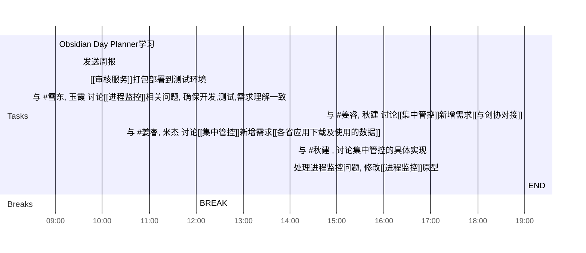

## Day Planner

### 上午安排
   
- [x] 09:00 Obsidian Day Planner学习
- [x] 09:30 发送周报
- [x] 09:40 [[审核服务]]打包部署到测试环境
- [x] 12:00 BREAK

### 下午安排

- [x] 14:00 与 #雪东,  玉霞     讨论[[进程监控]]相关问题, 确保开发,测试,需求理解一致
	- 开完会了
	- 处理问题列表
- [x] 14:42 与 #姜睿,  秋建     讨论[[集中管控]]新增需求[[与创协对接]]
- [x] 16:00 与 #姜睿,  米杰     讨论[[集中管控]]新增需求[[各省应用下载及使用的数据]]
- [x] 17:00 与 #秋建 , 讨论集中管控的具体实现
- [x] 17:15 处理进程监控问题, 修改[[进程监控]]原型
- [x] 19:00 END