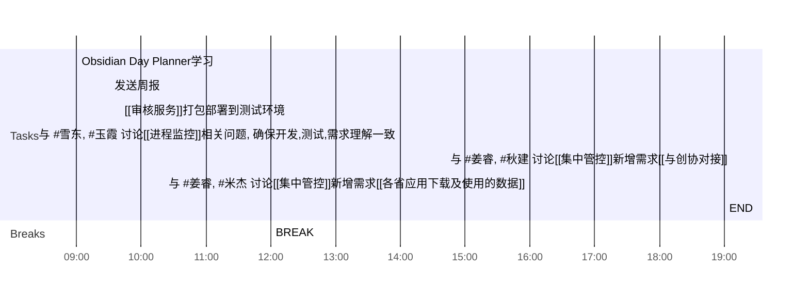

## Day Planner

1. 上午安排
2. 下午安排

### 上午安排
   
- [ ] 09:00 Obsidian Day Planner学习
- [ ] 09:30 发送周报
- [ ] 09:40 [[审核服务]]打包部署到测试环境
- [ ] 12:00 BREAK

### 下午安排

- [ ] 14:00 与 #雪东,  #玉霞     讨论[[进程监控]]相关问题, 确保开发,测试,需求理解一致
- [ ] 14:42 与 #姜睿,  #秋建     讨论[[集中管控]]新增需求[[与创协对接]]
- [ ] 16:00 与 #姜睿,  #米杰     讨论[[集中管控]]新增需求[[各省应用下载及使用的数据]]
- [ ] 19:00 END