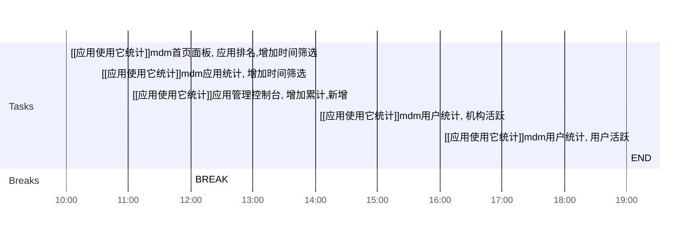

## Day Planner

### 上午安排
- [ ] 10:00 [[应用使用它统计]]mdm首页面板, 应用排名,增加时间筛选
- [ ] 10:30 [[应用使用它统计]]mdm应用统计, 增加时间筛选
- [ ] 11:00 [[应用使用它统计]]应用管理控制台, 增加累计,新增
- [ ] 12:00 BREAK

### 下午安排
- [ ] 14:00 [[应用使用它统计]]mdm用户统计, 机构活跃
- [ ] 16:00 [[应用使用它统计]]mdm用户统计, 用户活跃
- [ ] 19:00 END