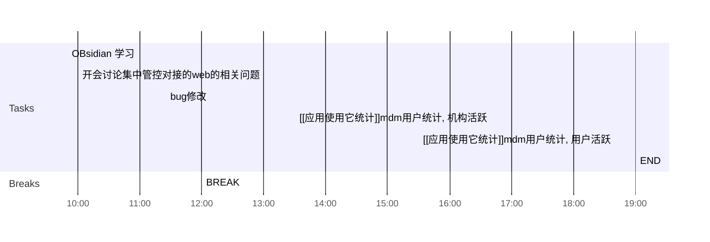

## Day Planner

## 上午安排
- [x] 09:50 OBsidian 学习
	- Obsidian Chart
- [x] 10:00 开会讨论集中管控对接的web的相关问题
	- 接口文档,修改后,发给创协的人 #doing
	- web端的分页接口,发给张乐 #doing
	- 原型修改,发给张乐
- [ ] 11:25 bug修改
	- 23867 轻应用审核详情, 显示配置信息
	- 23862 审核记录对应的应用被删除导致 
	- 23861 
	- 23860 原mdm的审核开关去掉, 且对应的菜单使用新的来确定------
	- 23859 需要确认, 错误码配错了, 应该是有待审计的审核记录, 不能升级-------
	- 23855 修改原型, 草稿和退回使用相同的颜色, 审核中显示为浅绿色吧------
	- 23853 暂未实现
	- 23852 张乐修改-----------
	- 23850 去掉Ip列, 同23838
	- 23848
	- 23843 确定原因???
	- 23839 
	- 23849 确定原因???--------------------
	- 23835 需要姜睿确定一下如何修改
	- 23797 修改原型
- [ ] 12:00 BREAK

## 下午安排
- [ ] 13:30 [[应用使用它统计]]mdm用户统计, 机构活跃
	- 制定计划
		- 用户活跃
			- 全量更新历史数据
			- 增量更新每天的数据
				- 结束时间最大为昨天
				- 每个用户每天三条记录, 全部, 应用市场, 用户安装
			- table数据查询, 导出
			- 活跃分布
			- 时长分布
			- 次数分布
			- 流量分布
		- 机构活跃
			- table数据查询,导出
		- 设备统计-设备在线分布
			- 全量更新历史数据
			- 增量更新每天的数据
			- table数据查询, 导出
			- 设备在线分布
	- 具体实现
- [ ] 15:30 [[应用使用它统计]]mdm用户统计, 用户活跃
	- 制定计划, 具体实现
- [ ] 19:00 END