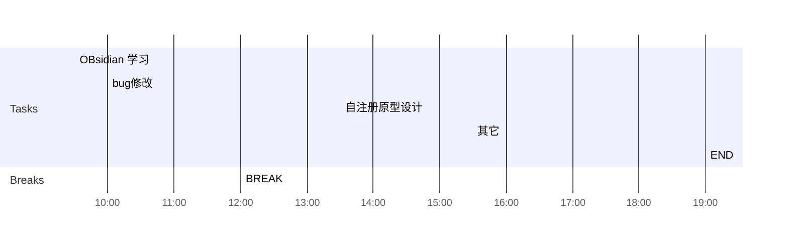

## Day Planner

## 上午安排
- [x] 09:30 OBsidian 学习
- [x] 10:00 bug修改
	- 23890 不能重复提交, 需要确认代码逻辑, --上架增加逻辑, 是否有待审核记录----
	- 23886 暂不增加
	- 23885 增加安装量-------------
	- 23867 轻应用审核详情, 显示配置信息,   暂不修改
	- 23862 审核记录对应的应用被删除导致 ,确定方案, 暂不修改
	- 23853 暂未实现, 审核提醒,发送短信, 暂不修改
	- 23848 地址如何确定的问题, web端确定,还是服务端确定,最好web端确定--------
	- 23839 国际化, 暂不修改
	- 23835 需要姜睿确定一下如何修改
	- 23797 修改原型, 导出的模板
- [x] 12:00 BREAK

## 下午安排
- [x] 13:30 自注册原型设计
- [x] 15:30 其它
- [x] 19:00 END