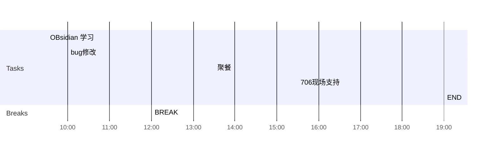

## Day Planner

## 上午安排
- [x] 09:30 OBsidian 学习
- [ ] 10:00 bug修改
	- 23878 设计如此-----------
	- 23890 不能重复提交, 需要确认代码逻辑, --上架增加逻辑, 是否有待审核记录----
	- 23885 增加安装量-------------
	- 23848 地址如何确定的问题, web端确定,还是服务端确定,最好web端确定--------
	- 23836 ------------
- [ ] 12:00 BREAK

## 下午安排
- [ ] 13:30 聚餐
- [ ] 15:30 706现场支持
- [ ] 19:00 END