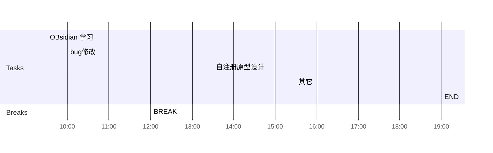

## Day Planner

## 上午安排
- [x] 09:30 OBsidian 学习
- [x] 10:00 bug修改
	- 23894 ---------------------
	- 23900 国际化, 暂不修改
	- 23899 国际化, 暂不修改
	- 23839 国际化, 暂不修改
	- 23853 暂未实现, 审核提醒,发送短信, 暂不修改
	- 23856 最后修改,预览效果, 暂不修改
	- 23867 轻应用审核详情, 显示配置信息,   暂不修改--------------------
	- 23862 审核记录对应的应用被删除导致 ,确定方案, 暂不修改-------------
	- 23854 权限管理的时候,再修改--------------------------
	- 23886 暂不增加, 审核日志
	- 23850 需要验证????
	- 23835 需要姜睿确定一下如何修改
	- 23797 修改原型, 导出的模板
	- 23847 运维, 编辑服务
	- 23809 非8.1的bug
	- 23809 
	- 23751 
	- 12731 
	- 23637 
	- 
- [x] 12:00 BREAK

## 下午安排
- [x] 13:30 自注册原型设计
- 4600, 对应的登录页面关闭, 4605对应的登录页面修改名称 #process/todo 
- [ ] 15:30 其它
- [ ] 19:00 END