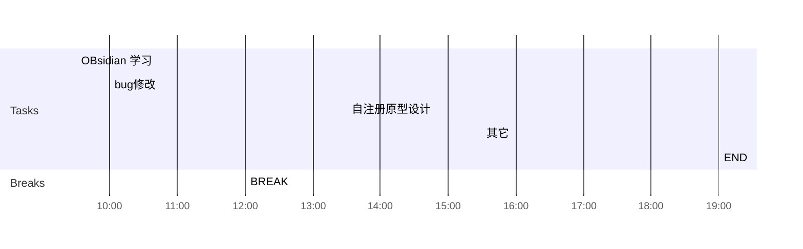

## Day Planner

## 上午安排
- [x] 09:30 OBsidian 学习
- [x] 10:00 bug修改
	- 23894 ---------------------
	- 23867 轻应用审核详情, 显示配置信息,   暂不修改--------------------
	- 23862 审核记录对应的应用被删除导致 ,确定方案, 暂不修改-------------
	- 23854 权限管理的时候,再修改--------------------------
- [x] 12:00 BREAK

## 下午安排
- [x] 13:30 bug修改
- [x] 19:00 END