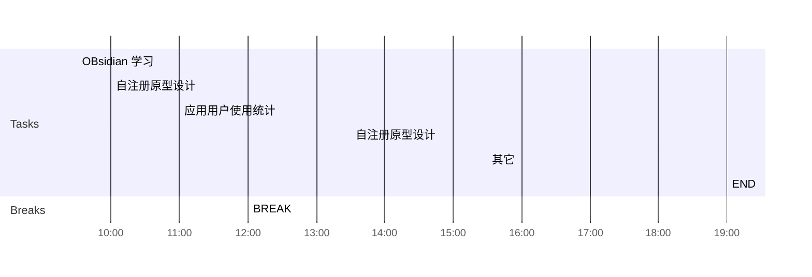

## Day Planner

## 上午安排
- [x] 09:30 OBsidian 学习
- [ ] bug修改
	- 23809 非8.1的bug
	- 23856, 23853, 23847, 23797, 23973, 23850, 
	- 23886, 
	- 23839, 
	- 23731, 23637, 
	- 23751 
- [ ] 10:00 自注册原型设计
- [ ] 11:00 应用用户使用统计
- [ ] 12:00 BREAK

## 下午安排
- [ ] 13:30 自注册原型设计
- 4600, 对应的登录页面关闭, 4605对应的登录页面修改名称 #process/todo 
- 自注册原型, 老侯在设计, 有点复杂
- 706导出数据, 如何实现![[2381637717271_.pic.jpg]], 
	- 只考虑注册用户数, 日均使用人数
- [ ] 15:30 其它
- [ ] 19:00 END
