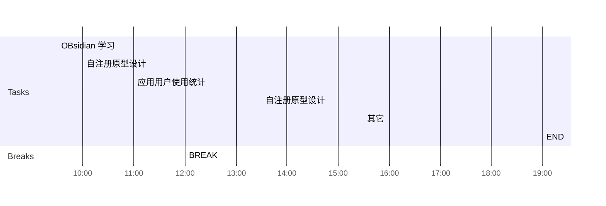

## Day Planner


## 上午安排
- [x] 09:30 OBsidian 学习
- [ ] bug修改
	- 23809 非8.1的bug
	- 23856, 23853, 23847, 23797, 23973, 23850, 
	- 23886, 
	- 23839, 
	- 23731, 23637, 
	- 23751 
- [x] 10:00 自注册原型设计
- [x] 11:00 应用用户使用统计
- [x] 12:00 BREAK

## 下午安排
- [x] 13:30 自注册原型设计
- 4600, 对应的登录页面关闭, 4605对应的登录页面修改名称 #process/todo 
- 自注册原型, 老侯在设计, 有点复杂
- 706导出数据, 如何实现![[2381637717271_.pic.jpg]], 
	- 只考虑注册用户数, 日均使用人数
- [x] 15:30 其它
- [x] 19:00 END
- 应用统计, 列表支持明细统计, 需要增加搜索, 但会导致排名无效????
- 实现角度, 考虑
	- 对比图, 有坑, 数据量太大了, 
	- 用户数* 应用数 * 天数

```chart
type: line
labels: [2021-11-20,2021-11-21,2021-11-22,2021-11-23,2021-11-24]
series:
  - title: 时长
    data: [10.21,11.22,12.23,10.11,10.22]
tension: 0.2
width: 80%
labelColors: false
fill: false
beginAtZero: false
```

```chart
type: bar
labels: [360浏览器,QQ,微信,淘宝,京东]
series:
  - title: 使用时长(小时)
    data: [10.21,11.22,12.23, 5.22,6.33]
tension: 0.2
width: 80%
labelColors: false
fill: false
beginAtZero: false
```

```chart
type: bar
labels: [360浏览器,QQ,微信,淘宝,京东]
series:
  - title: 使用次数
    data: [500,654,788,121,300]
tension: 0.2
width: 80%
labelColors: false
fill: false
beginAtZero: false
```

```chart
type: bar
labels: [360浏览器,QQ,微信,淘宝,京东]
series:
  - title: 使用流量(M)
    data: [100,321,456,200,50]
tension: 0.2
width: 80%
labelColors: false
fill: false
beginAtZero: false
```