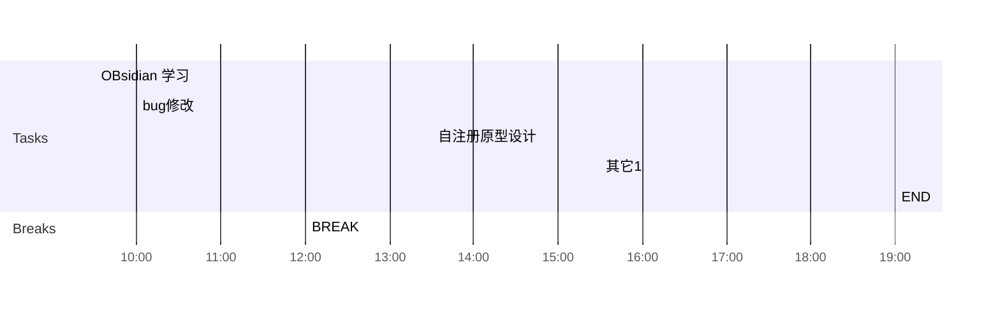

## Day Planner

```mermaid
gantt
    dateFormat  HH-mm
    axisFormat %H:%M
    %% Current Time: 下午2:37:10
    section Tasks
    OBsidian 学习     :09-30, 30mm
    bug修改     :10-00, 120mm
    自注册原型设计     :13-30, 120mm
    其它1     :15-30, 210mm
    END     :19-00, 0mm
    section Breaks
    BREAK     :12-00, 90mm
```

## 上午安排
- [x] 09:30 OBsidian 学习
- [x] 10:00 bug修改
- [x] 12:00 BREAK

## 下午安排
- [ ] 13:30 自注册原型设计
- [ ] 15:30 其它1
- [ ] 19:00 END