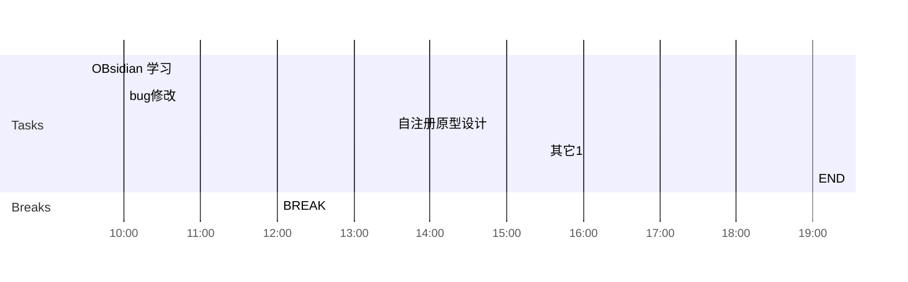

## Day Planner

## 上午安排
- [x] 09:30 OBsidian 学习
- [x] 10:00 bug修改
- [x] 12:00 BREAK

## 下午安排
- [x] 13:30 自注册原型设计
- [ ] 15:30 其它1
- [ ] 19:00 END

> 
<iframe src="https://sspai.com/post/63529" allow="fullscreen" style="background-color:White;position: absolute; top: 0px; left: 0px; height: 100%; width: 100%; "></iframe>
[[待办事项]]

https://cloud.tencent.com/developer/article/1806886

https://www.cnblogs.com/zxq-Study-Java/p/10040632.html
https://blog.csdn.net/zlj1217/article/details/81611834
https://blog.csdn.net/lsgqjh/article/details/63686383
https://blog.51cto.com/glblong/1312340