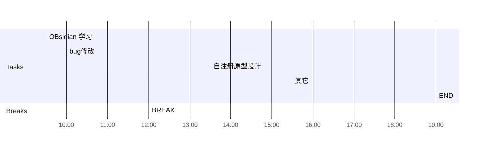

## Day Planner

## 上午安排
- [x] 09:30 OBsidian 学习
- [x] 10:00 bug修改
- [x] 12:00 BREAK

## 下午安排
- [ ] 13:30 自注册原型设计
- [ ] 15:30 其它
- [ ] 19:00 END

问题: 应用管理每天自动打包, 自动部署, 但部署后沙箱版本会变老
解决: 自动部署后, 部署最新的沙箱版本

问题: 审核功能, 设计到三权分立, 应用管理, mdm服务, 如何快速一键部署
解决: 增加审核功能的jenkins, 执行后, 自动部署应用管理,mdm服务, 三权分立

抽象: 如何构建部署链条

