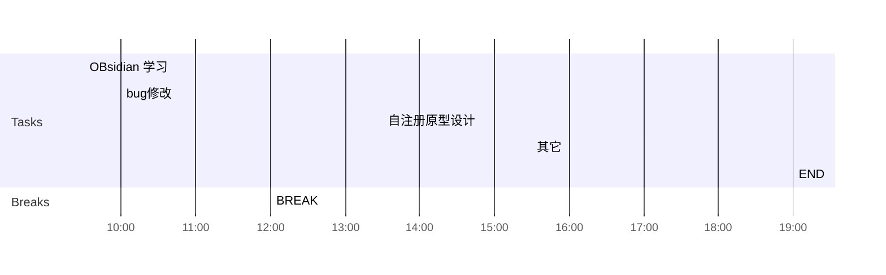

## Day Planner

## 上午安排
- [x] 09:30 convert部署，maxwell部署
- [x] 10:00 铁路公安-蓝牙白名单，web部署
- [x] 11:00  convert服务，上报资源数据给全国集中管控
- [x] 11:30 铁路公安，OTG
- [x] 12:00 BREAK

## 下午安排
- [x] 13:30 联调省集中管控，maxwell，convert，国家集中管控
- [x] 14:00 接入网络联调convert和国家和cmc的数据库
- [x] 15:00 check_cmc_id
- [x] 15:30 OTG开发
- [x] 19:00 END

