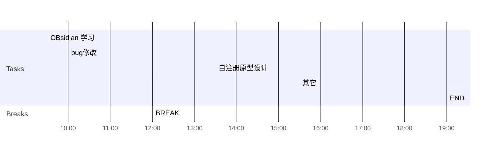

## Day Planner

## 上午安排
- [x] 09:30 提供添加设备违规日志的逻辑
- [x] 10:00 省集中管控登录失败处理
- [x] 11:00 国家集中管控性能报告整理
- [x] 11:30 铁路公安部署包
- [x] 12:00 BREAK

## 下午安排
- [x] 13:30 convert数据转换
- [x] 15:30 其它
- [x] 19:00 END

## 国家集中管控性能调优
本地数据库数据量
用户 71万             用户首次查询  1.11秒，      平均(1100+685+633+697+595)/5=0.74秒
设备 71万             设备首次查询  3.82秒，    平均(3.19+2.99+2.96+2.80+2.97)/5=2.98秒
机构 24万            优化前， 机构首次查询  11.1秒， 后续平均(1.29+1.29+1.22+1.21+1.17)/5=1.23秒
                             优化后， 机构首次查询  6.1秒,    后续平均(1510+878+937+916+893)/5=1.03秒
安全事件 283万  事件首次查询 5.66秒，      平均(5.66+4.85+4.39+4.06+3.71)/5 = 4.53秒
                              优化查询语句后，   平均(3.49+3.43+3.75+3.70+3.71)/5 = 3.62秒

现场数据库数据量
用户 85万             用户5.1秒
设备 134万           设备5.5秒
机构 36万            机构2秒
安全事件 400万  事件超过50秒

机构优化的逻辑： 
	1. 查询各省用户数（有缓存）
	2. 查询机构列表，机构信息中有areaCode
	3. 遍历机构列表，查询province，根据province的AreaCode从各省用户数中获取该省用户数
修改： 去掉查询province表， 直接根据机构的areaCode从各省用户数中获取该省用户数

用户，设备，安全事件，代码逻辑都是单表查询，且查询条件字段都有索引，优化空间不大

现场环境比本地环境慢的原因猜测：
1. 现场数据比本地数据量略大一些
2. 数据库和服务，现场位于两台机器上，有需要可以在本地验证一下

1.  数据库的其它查询（大屏）会频繁访问数据库，是否对性能有影响
2. 有数据读写确定是否影响访问性能
3. 设备与用户数量相同，查询时间不同，确定查询条件和返回结果对时间的影响
4. mysql版本和配置是否有影响
5. 针对机构，用户，设备，安全事件的列表查询，使用queryDsl   
6. 大屏的首次查询慢的原因

安全事件查询时间超过50秒的问题，还需要在现场才可以分析原因，从最新的代码看不会出现该问题。 

后续工作：
1. 现场确认安全事件查询超时的原因
2. 将数据库和服务器部署到两台机器上，与单机部署比较时间差异

## 级联日志

｜子平台建设情况｜成功｜
｜机构｜成功｜
｜人员｜成功｜
｜移动终端｜成功｜
｜移动终端状态｜成功｜
｜移动应用状态｜成功｜
｜平台安全事件｜成功｜
｜移动应用｜成功｜

｜应用支撑系统｜成功｜
｜接入网络｜成功｜
｜建设状态｜成功｜
｜服务资源｜成功｜

｜网络设施信息｜成功｜
｜移动应用服务端｜成功｜

｜拓扑图｜未实现｜
｜文件上传｜未实现｜

｜用户活跃信息｜未实现｜
｜移动应用整体日活跃信息｜未实现｜
｜移动应用个体日活跃信息｜未实现｜
｜服务资源状态｜未实现｜
｜服务资源整体日活跃信息｜未实现｜
｜服务资源个体日活跃信息｜未实现｜

