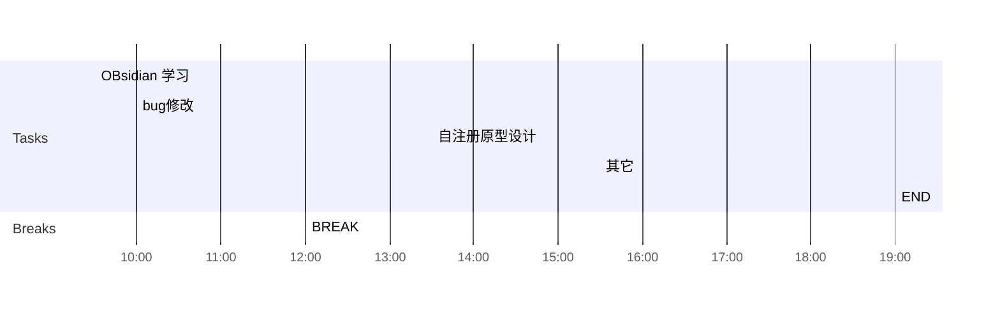

## Day Planner

## 上午安排
- [x] 09:30 提供添加设备违规日志的逻辑
- [x] 10:00 省集中管控登录失败处理
- [ ] 11:00 国家集中管控性能报告整理
- [x] 12:00 BREAK

## 下午安排
- [x] 13:30 自注册原型设计
- [x] 15:30 其它
- [x] 19:00 END

本地数据库数据量
用户 71万             用户首次查询  1.11秒，      平均(1100+685+633+697+595)/5=0.74秒
设备 71万             设备首次查询  3.82秒，    平均(3.19+2.99+2.96+2.80+2.97)/5=2.98秒
机构 24万            优化前， 机构首次查询  11.1秒， 后续平均(1.29+1.29+1.22+1.21+1.17)/5=1.23秒
                             优化后， 机构首次查询  6.1秒,    后续平均(1510+878+937+916+893)/5=1.03秒
安全事件 283万  事件首次查询 5.66秒，      平均(5.66+4.85+4.39+4.06+3.71)/5 = 4.53秒

现场数据库数据量
用户 85万             用户5.1秒
设备 134万           设备5.5秒
机构 36万            机构2秒
安全事件 400万  事件超过50秒

机构优化的逻辑： 
	1. 查询各省用户数（有缓存）
	2. 查询机构列表，机构信息中有areaCode
	3. 遍历机构列表，查询province，根据province的AreaCode从各省用户数中获取该省用户数
修改： 去掉查询province表， 直接根据机构的areaCode从各省用户数中获取该省用户数

用户，设备，安全事件，代码逻辑都是单表查询，且查询条件对应的字段都有索引

现场环境比本地环境慢的原因：
1. 用户设备机构，现场数据比本地数据量略大一些， 数据库和服务，现场位于liang't

本地环境与现场环境的区别
1. 本地环境数据库与服务在同一个机器中，现场位于两台机器中