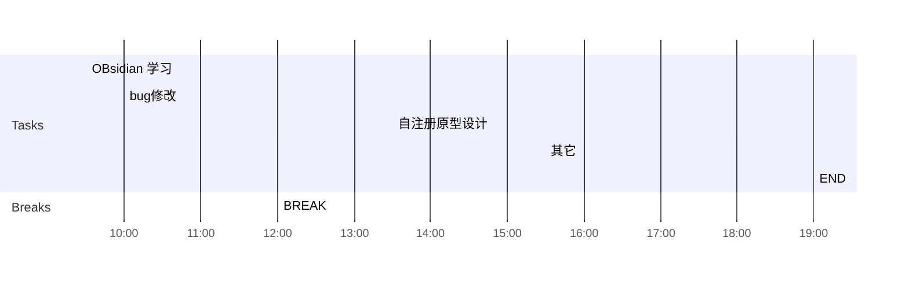

## Day Planner

## 上午安排
- [ ] 09:30 convert转换
- [ ] 10:00 bug修改
- [ ] 12:00 BREAK

## 下午安排
- [ ] 13:30 
- [ ] 15:30 铁路公安现场升级
- [ ] 19:00 END

｜网络设施信息｜没有数据｜

｜拓扑图｜未实现｜
｜移动应用服务端｜未实现｜
｜文件上传｜未实现｜

｜用户活跃信息｜未实现｜
｜移动应用整体日活跃信息｜未实现｜
｜移动应用个体日活跃信息｜未实现｜
｜服务资源状态｜未实现｜
｜服务资源整体日活跃信息｜未实现｜
｜服务资源个体日活跃信息｜未实现｜

｜建设状态｜失败｜

后续工作：
1. 现场确认安全事件查询超时的原因
2. 将数据库和服务器部署到两台机器上，与单机部署比较时间差异

#规范/省集中管控接口文档
![[集中管控中心接口规范_v5.0.1(20220922)_1.docx]]

