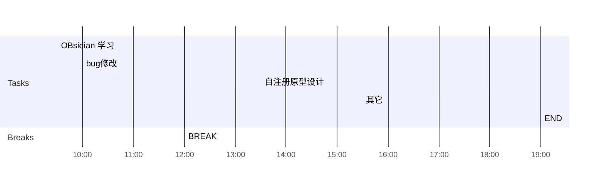

## Day Planner

## 上午安排
- [x] 09:30 convert剩余接口测试
- [ ] 10:00 国家集中管控性能调优，修改查询方式
- [ ] 12:00 BREAK

## 下午安排
- [ ] 13:30 bug修改
- [ ] 15:30 拓扑图上传过程整理
- [ ] 19:00 END

｜拓扑图｜成功｜
｜文件上传｜成功｜

｜用户活跃信息｜未实现｜
｜移动应用整体日活跃信息｜未实现｜
｜移动应用个体日活跃信息｜未实现｜
｜服务资源状态｜未实现｜
｜服务资源整体日活跃信息｜未实现｜
｜服务资源个体日活跃信息｜未实现｜

1.  数据库的其它查询（大屏）会频繁访问数据库，是否对性能有影响
2. 有数据读写确定是否影响访问性能
3. 设备与用户数量相同，查询时间不同，确定查询条件和返回结果对时间的影响
4. mysql版本和配置是否有影响
5. 针对机构，用户，设备，安全事件的列表查询，使用queryDsl   
6. 大屏的首次查询慢的原因

cmc-report-09-27的type为text，不为keyword

#规范/部省级联接口文档 
![[移动警务安全集中管控部省级联指南v2.0.6.pdf]]

#规范/省集中管控接口文档 
![[集中管控中心接口规范_v5.0.1(20220922)_2.docx]]

