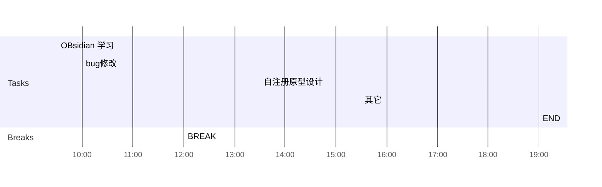

## Day Planner

## 上午安排
- [ ] 15:30 拓扑图上传过程整理
- [ ] 10:00 国家集中管控性能调优，修改查询方式
- [ ] 12:00 发送性能调优邮件

## 下午安排
- [ ] 13:30 flink学习
- [ ] 15:30 写一个活跃的example
- [ ] 19:00 END

｜用户活跃信息｜未实现｜
｜移动应用整体日活跃信息｜未实现｜
｜移动应用个体日活跃信息｜未实现｜
｜服务资源状态｜未实现｜
｜服务资源整体日活跃信息｜未实现｜
｜服务资源个体日活跃信息｜未实现｜

1.  数据库的其它查询（大屏）会频繁访问数据库，是否对性能有影响
2. 有数据读写确定是否影响访问性能
3. 设备与用户数量相同，查询时间不同，确定查询条件和返回结果对时间的影响
4. mysql版本和配置是否有影响
5. 针对机构，用户，设备，安全事件的列表查询，使用queryDsl   
6. 大屏的首次查询慢的原因

cmc-report-09-27的type为text，不为keyword

本地数据库数据量
用户 71万             用户首次查询  1.11秒，      平均(1100+685+633+697+595)/5=0.74秒
设备 71万             设备首次查询  3.82秒，    平均(3.19+2.99+2.96+2.80+2.97)/5=2.98秒
                             优化查询语句后，   平均(2.67+1.88+1.80+1.91+1.86)/5 = 2.02秒
机构 24万            优化前， 机构首次查询  11.1秒， 后续平均(1.29+1.29+1.22+1.21+1.17)/5=1.23秒
                             优化后， 机构首次查询  6.1秒,    后续平均(1510+878+937+916+893)/5=1.03秒
安全事件 283万  事件首次查询 5.66秒，      平均(5.66+4.85+4.39+4.06+3.71)/5 = 4.53秒
                              优化查询语句后，   平均(1.76+1.73+1.77+1.67+1.69)/5 = 1.72秒