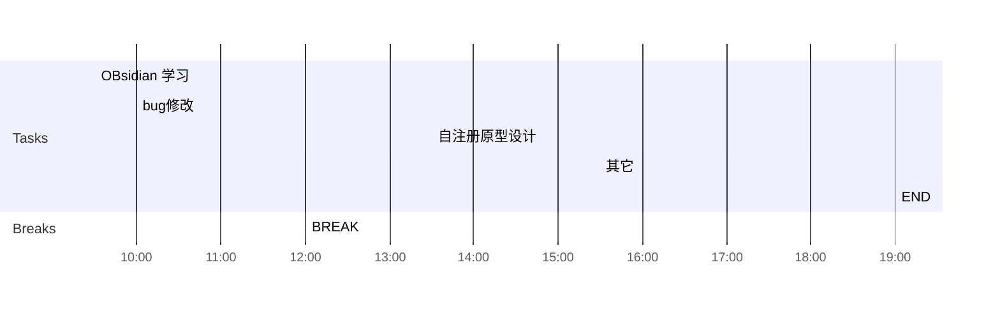

## Day Planner

## 上午安排
- [x] 09:30 国家集中管控，使用queyDsl查询机构和用户列表
- [ ] 10:00 省集中管控，增加拓扑图上传逻辑
- [ ] 12:00 BREAK

## 下午安排
- [ ] 13:30 bug修改
- [ ] 15:30 使用Flink统计活跃数据
- [ ] 16:00 国家集中管控，升级准备
- [ ] 19:00 END

## 国家集中管控升级
1. 进一所
	1.  需要提供给董欣， 姓名，身份证号，行程码，健康宝
	2. 预计下周二可以进一所
	3. 进所当天，需要满足核酸48小时， 和上面的要求
2. 进机房
	1.  通知董欣， 访问南机房的192.168.20.40, 是一台物理机
	2. 让董欣，找几个三类区的IP， 目的是大屏可以访问的机器（可以提前发给董欣，提前准备）
	3. 董欣会找李勇，去南机房
3. 登录物理服务器
	1. 李勇找到对应的机器后，登录用户名密码
	2. 是一台windows的物理机，里面有虚拟机软件
	3. 查看41，42，43，44的虚拟机占用的CPU，内存，磁盘，确定新创建的虚拟机需要的大小
	4. 查看物理机剩余的内存， 确定是否够用
	5. 备份41上的mysql数据
4. 创建虚拟机
	1. 先创建一台虚拟机192.168.20.51， CPU和内存、磁盘同测试环境41
	2. mysql所在的虚拟机的CPU需要多分配一些
	3. 需要使用光驱，安装centos7.5，安装过程，参考安装说明
	4. 配置IP信息，关闭防火墙
	5. 之后等部署并验证完测试环境后，再创建其它的虚拟机，使用复制的方式
		1.  关闭虚拟机51
		2. 复制虚拟机52，53，54
		3. 修改对应的IP，关闭防火墙
		4. 再启动虚拟机51，52，53，54
		5. 需要关闭52的mysql和es及开机自启
		6. 关闭53的除了mysql之外的所有服务和es及开机自启
		7. 关闭54的除了es之外的所有服务和mysql及开机自启
5. 测试环境部署，迁移，测试
	1. 先从现场测试环境（192.168.20.41）， 备份历史数据
	2. 在51上，进行国家集中管控测试环境的安装
	3. 测试51上部署的国家集中管控
	4. 备份现在的数据库，用于出现问题后，回滚数据
	5. 将41上历史数据在51上执行，对比perf_opt.sql（之前手动增加的索引），删除对应的索引
	6. 再次在51上，进行国家集中管控的升级
	7.  测试升级后的集中管控
	8.  在nginx中配置大屏的允许访问的IP
6. 正式环境部署，迁移，测试
	1.  在现场正式环境（43）上， 停用nginx， 等待一段时间后（等国家集中管控煤没有日志后）， 备份mysql历史数据
	2. 将43历史数据在52，53，54上执行，对比perf_opt.sql（之前手动增加的索引），删除对应的索引
	3. 再次在52，53，54，进行国家集中管控的升级
	4.  测试升级后的集中管控
	5.  在nginx中配置大屏的允许访问的ip
	6. 44138，44139，44140 如何配置 #todo ,需要一所的人配置

1. 红雷
	1. 51，52，53，54对应的ip， cpu，内存，磁盘各需要多少
		1. 根据现场的实际情况而定，53作为mysql，需要配置的cpu大一些
	2. 51对应的测试环境，52，53，54分别对应什么
		1. 51：测试环境，52：正式环境，53：mysql，54：es
	3. 光驱和光盘， centos7.5的安装选项
		1. 参考安装手册
	4. 是关闭防火墙，还是需要配置防火墙
		1. 关闭防火墙
	5. 44138，44139，44140如何配置，如何配置成外网映射
		1. 一所的人来配置
| 对外IP      | 对外端口 | 内部IP              | 内部端口 | 说明              |
| ----------- | -------- | ------------------- | -------- | ----------------- |
| 10.2.64.165 | 10019    | 192.168.20.41（51） | 44138    | 测试环境-上报数据 |
| 10.2.64.165 | 10020    | 192.168.20.42（52） | 44138    | 生产环境-上报数据 |
| 10.2.64.165 | 10021    | 192.168.20.42（52） | 44139    | 生产环境-大屏     |
| 10.2.64.165 | 10022    | 192.168.20.42（52） | 44140    | 生产环境-web      |
| 10.2.64.165 | 10024    | 192.168.20.41（51） | 44139    | 测试环境-大屏     |
| 10.2.64.165 | 10025    | 192.168.20.41（51） | 44140    | 测试环境-web      | 
2. 董欣
	1. 确定是部署迁移升级国家集中管控
	2. 协助进入南机房
	3. 提供几个三类区的ip，可以访问大屏的ip
3. 李勇
	1. 进入南机房
	2. 登录南机房国家集中管控对应的物理机
	3. 查看机器剩余内存是否够用
4. 小胡
	1. 测试环境部署后验证功能
	2. 正式环境部署后验证功能
5. 我
	1. 创建虚拟机
	2. 配置IP
	3. 部署，迁移，升级，测试
6. 工具
	1. 光驱，centos7.5光盘，国家集中管控全量安装包，索引文件列表
7. 中间数据
	1. 导出测试环境的mysql的数据
	2. 导出正式环境的mysql的数据
8. 关键节点
	1. 正式环境数据导出前，需要停止nginx
	2. 正式环境部署测试完成后，需要切换到新的正式环境
9. 其它
	1.  和红雷确定之前的部署图，和现在的部署图
	2. 测试哪些功能，如何测试？？
	3. 可以连接电脑，使用jmeter进行测试吗，数据生成？？？

映射关系，需要一所的人来进行配置
III区地址	III区端口	内网IP	内网端口	备注
10.2.64.165	10019	192.168.20.41	44138	测试环境-上报数据
                	10020	192.168.20.42	44138	生产环境-上报数据
	                10021	192.168.20.42	44139	生产环境-大屏
	                10022	192.168.20.42	44140	生产环境-web
	                10024	192.168.20.41	44139	测试环境-大屏
	                10025	192.168.20.41	44140	测试环境-web