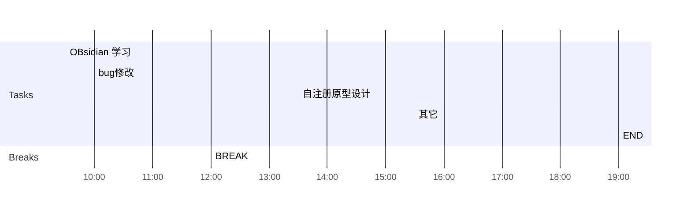

## Day Planner

## 上午安排
- [ ] 09:30 国家集中管控，使用queyDsl查询机构和用户列表
- [ ] 10:00 省集中管控，增加拓扑图上传逻辑
- [ ] 12:00 BREAK

## 下午安排
- [ ] 13:30 bug修改
- [ ] 15:30 使用Flink统计活跃数据
- [ ] 19:00 END

## 国家集中管控升级
1. 进一所
2. 进机房
3. 登录物理服务器
4. 创建虚拟机
5. 部署
6. 测试
7. 迁移
8. 
9. 去一所找董欣升级国家集中管控
	1. 需要提供姓名，身份证号，行程码，健康宝
	2. 访问南机房的192.168.20.40, 是一台物理机
	3. 李勇帮忙确定是哪台物理机，登录用户名密码
	4. 创建4台虚拟机，创建前需要确定剩余的内存情况，确定是否可以创建四台虚拟机
	5. 各个虚拟机的配置，与红雷确定，每个虚拟机的用途，与红雷确定
	6. 需要安装centos7.5, 需要使用光盘安装， 默认的密码pekall12#$ 
	7. 端口映射，测试环境和正式环境的映射
	8. 大屏只对制定ip开放，需要与董欣确定开发的ip
	9. 升级过程：先在新建的虚拟机上部署测试环境，验证没问题后，再备份数据库，然后进行数据迁移，迁移完成后，再次进行数据库的升级
		1. 备份老环境测试环境的数据库
		2. 