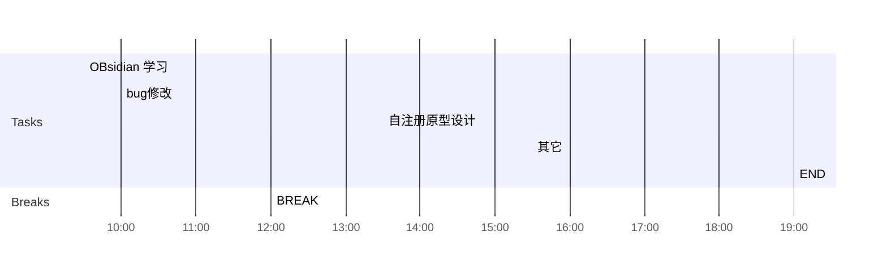

## Day Planner

## 上午安排
- [ ] 09:30 国家集中管控，使用queyDsl查询机构和用户列表
	- [x] 机构修改完
	- [ ] 用户
- [ ] 10:00 省集中管控，增加拓扑图上传逻辑
- [ ] 11:00 准备国家集中管控的升级文件
- [x] 12:00 BREAK

## 下午安排
- [ ] 13:30 bug修改
- [x] 19:00 END

- [ ] 省集中管控，设备基本信息中增加os
- [ ] 拓扑图上传，在级联日志或新增菜单中增加
- [ ] 学习flink