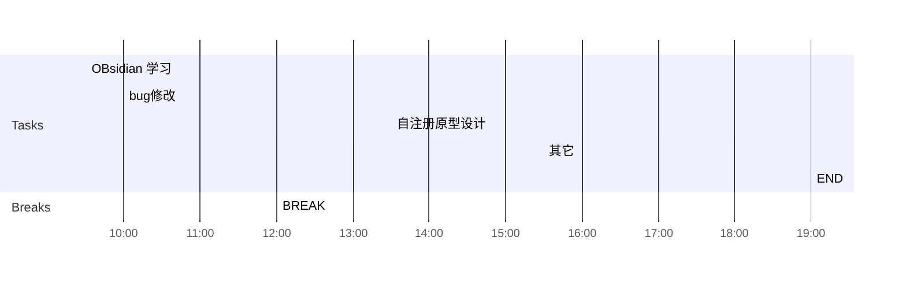

## Day Planner

## 上午安排
- [x] 09:30 一所现场， 国家集中管控功能测试
- [x] 10:00 
- [x] 12:00 BREAK

## 下午安排
- [x] 13:30 一所国家集中管控整理
- [x] 15:30 月报填写
- [x] 19:00 END
- [ ] 拓扑图上传的逻辑
- [ ] bug修改
- [ ] 国家集中管控，用户列表的调优
- [ ] 活跃数据生成，使用flink