## Day Planner

```mermaid
gantt
    dateFormat  HH-mm
    axisFormat %H:%M
    %% Current Time: 上午9:39:21
    section Tasks
    OBsidian 学习     :09-30, 30mm
    bug修改     :10-00, 120mm
    自注册原型设计     :13-30, 120mm
    其它     :15-30, 210mm
    END     :19-00, 0mm
    section Breaks
    BREAK     :12-00, 90mm
```

## 上午安排
- [x] 09:30 OBsidian 学习
- [x] 10:00 bug修改 🔼 🔁 every day
- [x] 12:00 BREAK ⏫ 📅 2022-10-18 

## 下午安排
- [x] 13:30  flink学习📅 2022-10-19 
- [x] 15:30 其它 🛫 2022-10-18 
- [x] 19:00 END ⏳ 2022-10-18 