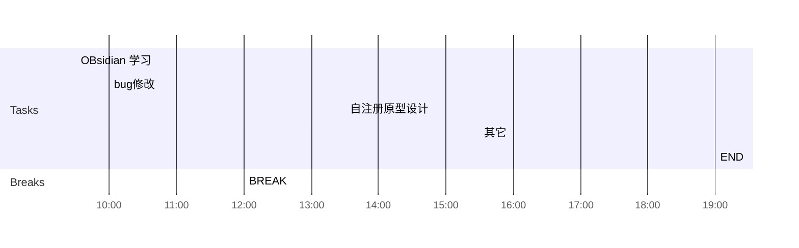

## Day Planner

## 上午安排
- [ ] 09:30 国家集中管控，使用queyDsl查询机构和用户列表
- [ ] 10:00 省集中管控，增加拓扑图上传逻辑
- [ ] 12:00 BREAK

## 下午安排
- [ ] 13:30 bug修改
- [ ] 15:30 使用Flink统计活跃数据
- [x] 16:00 国家集中管控，升级准备
- [ ] 19:00 END

- [ ] 省集中管控，设备基本信息中增加os
- [x] 国家集中管控中哪些字段必填，则省的也必须填，整理一下
	- [x]    设备必填项
	/**
     * 终端厂商
     */
    @Size(max = 255)
    private String manufacturer;

    /**
     * 终端型号
     */
    @Size(max = 255)
    private String terminalModel;
- [x] App行为日志，是coll从哪个kafka中收集上来的
	- [x] 应用使用日志，是从mdm发送的kafka同步过来的AppUsageDataBean， SysAppUsageDataBean
	- [x] 应用下载安装，是从应用市场同步过来的ass_sync_app_download_install
- [ ] 拓扑图上传，在级联日志或新增菜单中增加
- [ ] 估计下使用flink的时间