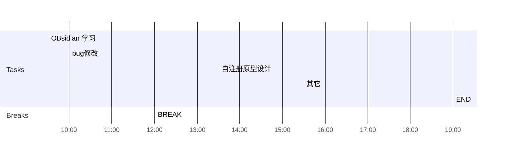

## Day Planner

## 上午安排
- [x] 09:30 国家集中管控导入慢，问题分析，索引问题导致
- [x] 10:00 无索引时，导入用户7分钟左右
- [x] 12:00 BREAK

## 下午安排
- [x] 13:30 国家集中管控，导入数据
- [x] 15:30 国家集中管控，数据库升级
- [x] 19:00 国家集中管控，补充索引
- [x] 20:00 基本功能验证