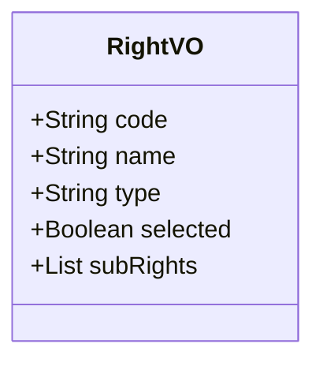

## WEB返回结果


## 例子
```
[{
	"code": "mdm",
	"name": "终端管控",
	"selected": "part"
	"rightVOList": [{
	[{
		"code": "user",
		"name": "用户管理",
		"selected": "part"
		"rightVOList": [{
			"code": "user",
			"name": "用户菜单",
			"selected": "part"
			"rightVOList": [{
				"code": "sendMessage",
				"name": "发送消息"
				"type": "write"
				"selected": true
			},{
				"code": "addUser",
				"name": "增加用户"
				"type": "write"
				"selected": false
			}]
		}]
	}]
}]

```

## 说明
- 四部分,对应系统, 一级菜单, 二级菜单, 按钮
- selected: 
	- none(没有选择任何权限), 
	- read(所有读取权限选择), write(所有编辑权限选择),
	-  all(所有权限选择), part(部分权限选择)
- type只有最终的会有值,read,write