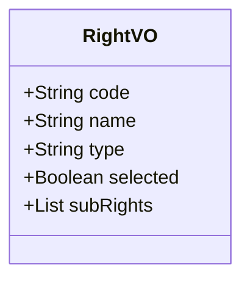

# 返回结果
## 角色管理
### 返回对象


### 例子
```
[{
	"code": "mdm",
	"name": "终端管控",
	"selected": "part"
	"rightVOList": [{
	[{
		"code": "user",
		"name": "用户管理",
		"selected": "part"
		"rightVOList": [{
			"code": "user",
			"name": "用户菜单",
			"selected": "part"
			"rightVOList": [{
				"code": "sendMessage",
				"name": "发送消息"
				"type": "write"
				"selected": true
			},{
				"code": "addUser",
				"name": "增加用户"
				"type": "write"
				"selected": false
			}]
		}]
	}]
}]
```

### 说明

需要增加id, selected需要增加true,false----------------
- 四部分,对应系统, 一级菜单, 二级菜单, 按钮
- selected: 
	- none(没有选择任何权限), 
	- read(所有读取权限选择), write(所有编辑权限选择),
	-  all(所有权限选择), part(部分权限选择)
- type只有最终的会有值,read,write
- 返回数据,有序, 同一级别按seq的升序排序
## 登录管理
### 返回对象
- 返回信息为List
- List内容为Code
- Code由module.category.menu.code组成
### 例子
```
[
	"mdm.user.user.sendMessage",
	"mdm.user.user.addUser",
	"mdm.user.org.addOrg"
]
```

### 说明
- 根据管理员查询所有的角色
- 根据角色查询所有的权限
- 去掉重复的权限
- 将所有RIGHT都转化为Code
- 返回Code列表, 按seq的升序排序