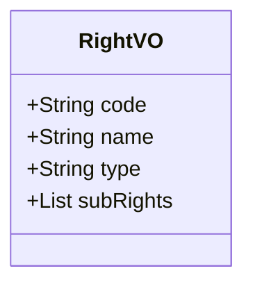

```
[{
	"code": "uas",
	"name": "统一认证",
	"type": "all"
}, {
	"code": "mdm",
	"name": "终端管控",
	"rightVOList": [{
		"code": "home",
		"name": "首页面板",
		"type": "read"
	}, {
		"code": "user",
		"name": "用户管理",
		"rightVOList": [{
			"code": "org",
			"name": "机构菜单",
			"type": "all"
		}]
	}, {
		"code": "user",
		"name": "用户管理",
		"rightVOList": [{
			"code": "user",
			"name": "用户菜单",
			"rightVOList": [{
				"code": "sendMessage",
				"name": "发送消息"
			}]
		}]
	}]
}]

type: none, read, write, all
```